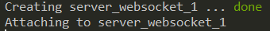
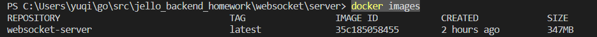
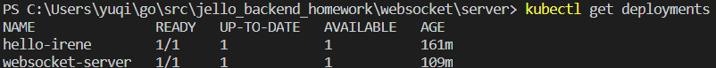
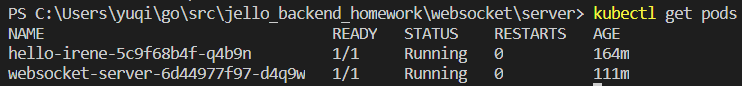
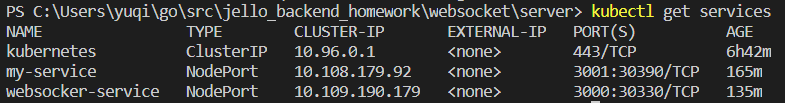

# jello_backend_homework_Irene-Ding

## homework content

[Homework.pdf](Homework.pdf)

## Server 自動化部署

### docker-compose

#### 相關配置檔

```md
\websocket\server\Dockerfile
\websocket\server\docker-compose.yml
```

#### 部署方式 (windows為例)

需有 docker 執行環境

step 1. 進入目錄層 jello_backend_homework\websocket\server

step 2. 執行

```sh
docker-compose up
```

step 3. 運行後會出現



step 4. server 部署完成

### minikube

#### 相關配置檔

```md
\websocket\server\Dockerfile
\websocket\server\deployment.yml
\websocket\server\service.yml
```

#### 部署方式 (windows為例)

需有 docker 執行環境、minikube 環境

step 1. 進入目錄層 jello_backend_homework\websocket\server

step 2. 設定 minikube docker 環境變數

此步驟目的是為了拉取本地 docker image，使用 minikube 的 docker 環境

powershell 下先執行:

```powershell
minikube docker-env
```

再執行

```powershell
& minikube docker-env | Invoke-Expression
```

step 3. build docker image

```powershell
docker build -t websocket-server .
```

查看 docker images

```powershell
docker images
```



step 4. 建立 deployment、pod

```powershell
kubectl create -f deployment.yml
```

查看 deployments

```powershell
kubectl get deployments
```



查看 pods

```powershell
kubectl get pods
```



step 5. 建立 service

```powershell
kubectl create -f service.yml
```

查看 services

```powershell
kubectl get services
```



step 6. server 部署完成

## Client local測試

[client 測試說明](websocket/client/README.md)