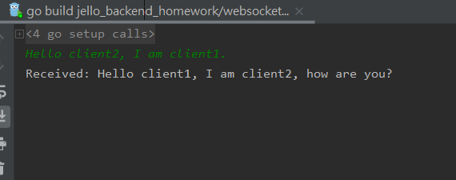
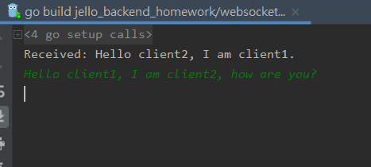

# Client local測試說明

## 測試場景

2個 client 端可以互傳訊息

## 測試步驟

step 1. 部署 server端

step 2. 建立第一個 client

執行 \example_user1\client.go

**注意: 不同的 server 部署方式，會有不同 server host 及 port，需替換**

```go
client.NewClient("192.168.99.101", "30330")
```

step 3. 建立第二個 client

執行 \example_user2\client.go

執行步驟同 step 2.

step 4. 即可在 console 端傳收訊息

過程會如下圖:

client1:


client2:

